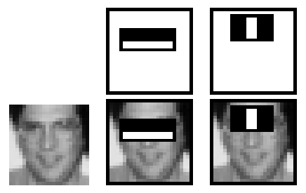

# Face-Tracker Project

Is it possible to track a person and their movement with a moving camera? I plan on exploring this with a raspberry pi and moving camera, and possibly exploring the idea of tracking a toddler (my son).

---

## Table of Contents
 - [EDA and Cleaning](#EDA-and-Cleaning)
   - [Planning](#Planning)
   - [Collecting photos](#Collecting-photos)
 - [Setting up Hardware](#Setting-up-Hardware)
   - [Hardware list](#Hardware-list)
   - [Pimoroni Pan-Tilt HAT](#Pimoroni-Pan-Tilt-HAT)
   - [Raspberry Pi](#Raspberry-Pi)
   - [Intel Neural Compute Stick 2 (Movidius)](#Intel-Neural-Compute-Stick-2-(Movidius))
 - [Setting up Software](#Setting-up-Software)
   - [Installing Raspberry Pi OS](#Installing-Raspberry-Pi-OS)
     - [Flashing with balena-Etcher](#Flashing-with-balena-Etcher)
   - [Setting up the Raspberry Pi](#Setting-up-the-Raspberry-Pi)
   - [Installing OpenCV](#Installing-OpenCV)
   - [Installing pantilthat repository from Pimoroni](#Installing-pantilthat-repository-from-Pimoroni)
   - [Installing OpenVINO](#Installing-OpenVINO)
   - [Neural Compute SDK v2 (NCSDK2)](#Neural-Compute-SDK-v2-(NCSDK2))
 - [Testing Hardware with Software](#Testing-Hardware-with-Software)
   - [Camera Testing](#Camera-Testing)
   - [Pan Tilt Hat testing](#Pan-Tilt-Hat-testing)
   - [Haar Cascade (from OpenCV Library)](#Haar-Cascade-(from-OpenCV-Library))
   - [YOLOv3 by xiaochus on github](#YOLOv3-by-xiaochus-on-github)
   - [Adding YOLOv4-tiny](#Adding-YOLOv4-tiny)
   - [Putting it all together](#Putting-it-all-together)
 - [Preprocessing](#Preprocessing)
   - [Annotating with CVAT](#Annotating-with-CVAT)
   - [Annotating and Augmented Images with RoboFlow](#Annotating-and-Augmented-Images-with-RoboFlow)
 - [Training and Generating Weights (Google Colab)](#Training-and-Generating-Weights-(Google-Colab))
   - [Adding weights, names, and cfg to the code](#Adding-weights,-names,-and-cfg-to-the-code)
 - [Analysis](#Analysis)
   - [Haar Cascade](#Haar-Cascade)
   - [You Only Look Once (YOLO)](#You-Only-Look-Once-(YOLO))
 - [Conclusion](#Conclusion)
 - [Future Considerations and Recommendations](#Future-Considerations-and-Recommendations)
   - [Install Ubuntu on Pi](#Install-Ubuntu-on-Pi)
   - [Implementation on different hardware](#Implementation-on-different-hardware)

---

---
## EDA and Cleaning
[(back to top)](#Face-Tracker-Project)

---

### Planning
[(back to top)](#Face-Tracker-Project)

This project was inspired by my son during video calls with his grandparents in Florida (my mom and dad). He is an active little fellow, and I thought it would be neat if there was a way that a camera could track his movement and adjust position so my son would generally stay in frame. This way my hands would be free to play with him (instead of holding the phone just out of his reach).

Since my phone does not have the capability to move on its own, I thought the next best thing would be a Raspberry Pi! For those who do not know, a [Raspberry Pi](https://www.raspberrypi.org/products/raspberry-pi-4-model-b/) is not only a delicious dessert, but it is also a tiny inexpensive computer, often described as "about the size of a credit card". When talking about the circuit board, this is accurate, but with all the components attached to it, and then put into a case, the size is closer to "about the size of a 2-inch thick credit card". 

I purchased this [CanaKit Raspberry Pi 4](https://www.amazon.com/gp/product/B08956GVXN/ref=ppx_yo_dt_b_asin_title_o06_s00?ie=UTF8&psc=1) which boasts a 4-core processor and a whopping 8GB of RAM (where the previous Raspberry Pi a nd 3 only had 1GB of RAM). This version of the Raspberry pi utilizes a 64-bit CPU which allows use for a 64-bit OS, but with some caveats.

From past research I know the Raspberry Pi has camera capabilities, as well as something called a "Pan-Tilt-Hat" which the camera can be mounted to for movement. The "Pan-Tilt-Hat" is a circuit board that can sit atop the Raspberry Pi (like a hat, hence that part of the name), and it contains two servos that allow the device to pan horizontally, and tilt vertically. 

From my research for this project, I found that I would need to install something called "OpenCV" which is a C/C++ based library that has a port to the Python programming language. This library seems to be __the__ library for anything involving object tracking and/or face detection.

---

### Collecting photos
[(back to top)](#Face-Tracker-Project)

With some help, I was able to download some training photos from Northeastern University's Augmented Cognition Lab's website. I trained a Keras model with these photos using Transfer Learning, but I later decided to abandon this route when I realized that I likely needed to freeze my Keras model in order to load it with OpenCV; A technique I am currently unfamiliar with. While this model scored well with the test set, I thought it may be the best to go another route since my son is now walking/running, and most of these images were infants crawling and laying down.

With this in mind, I decided to instead use photos of my son that my wife and I had taken over the past year. These were easy to gather and were more accessible; and I thoroughly enjoyed looking through these photos to find a good set for annotating, training, testing, and validating. It was around this time I began to discover that there are many, many methods of saving, loading, and keeping neural net data, which typically involves a weights file and another file for the network architecture.

---

---

## Setting up Hardware
[(back to top)](#Face-Tracker-Project)

---

### Hardware list
 - [Raspberry Pi 4, 8GB, CanaKit](https://www.amazon.com/gp/product/B08956GVXN/ref=ppx_yo_dt_b_asin_title_o06_s00?ie=UTF8&psc=1)
 - [Pimoroni Pan-Tilt HAT full kit](https://www.amazon.com/gp/product/B01N5E3I3W/ref=ppx_yo_dt_b_asin_title_o05_s00?ie=UTF8&psc=1)
 - [Raspberry Pi Camera Module V2, 8MP](https://www.amazon.com/gp/product/B01ER2SKFS/ref=ppx_yo_dt_b_asin_title_o06_s01?ie=UTF8&psc=1)
 - [12" Adafruit Flex Cable for Raspberry Pi Camera](https://www.amazon.com/gp/product/B00I6LJ19G/ref=ppx_yo_dt_b_asin_title_o06_s00?ie=UTF8&psc=1)
 - [Intel Neural Compute Stick 2 (Movidius)](https://www.amazon.com/gp/product/B07KT6361R/ref=ppx_yo_dt_b_asin_title_o06_s00?ie=UTF8&psc=1)

---

  

### Pimoroni Pan-Tilt HAT
[(back to top)](#Face-Tracker-Project)

I wrote a [blog post](https://christopher-j-caldarella.medium.com/assembling-the-pan-tilt-hat-ae90fc75d47c) about how I assembled the hardware for the Pimoroni Pan-Tilt Hat. Hopefully someone else finds it helpful. In summation, I bolted on the mechanism with the servos to the Pan-Tilt PCB, plugged the servos into the PCB, attached a face plate to the camera, and affixed the camera to the Pan-Tilt mechanism. Then I connected the Camera to the Raspberry Pi, and then the Pan-Tilt HAT. My [blog post](https://christopher-j-caldarella.medium.com/assembling-the-pan-tilt-hat-ae90fc75d47c) that I had mentioned earlier has pictures and goes into further detail.

---

  

### Raspberry Pi
[(back to top)](#Face-Tracker-Project)

The Raspberry Pi did not require much assembly once the Pan-Tilt HAT was attached, especially since the case does not fit on the Raspberry Pi with the Pan-Tilt mechanism protruding from the top of my Raspberry Pi. ALl that was left was to insert the microSD card (the system's Solid-State-Drive), plug in a USB Mouse and keyboard, plug in the monitor, and plug in the power. Fortunately, the CanaKit provided the microSD card, the Monitor cable, and the power supply.

---

  

### Intel Neural Compute Stick 2 (Movidius)
[(back to top)](#Face-Tracker-Project)

I had trouble getting this to work, and I talk more about it in the next section, [Setting up Software](#Setting-up-Software). Initially I was trying to get the [Google Coral USB *Accelerator*](https://coral.ai/docs/accelerator/get-started/), not to be confused with the very similar looking \$200 Coral compute *device*. 

The Google Coral USB Accelerator appears to be much more user-firendly, especially for Linux-based machines. But everywhere I looked these devices were back-ordered or sold-out, and I did not see any that would arrive in a timely fashion.

---

---

## Setting up Software
[(back to top)](#Face-Tracker-Project)

---

### Installing Raspberry Pi OS
[(back to top)](#Face-Tracker-Project)

The CanaKit I purchased came with a microSD card preloaded with "NOOBS" or "New Out Of Box Sofware". NOOBS starts with GUI and you can pick which OS you want to install, but after some reasearch I found that NOOBS is deprecated in favor of the Raspberry Pi OS (formerly known as Raspbian). Reasearching the best experieince with running OpenCV on Raspberry Pi, I decided to use the latest Raspbian OS.

The [Raspberry Pi Foundation](https://www.raspberrypi.org/about/) (a UK registered Charity Organization) makes it very easy to [install your Raspberry Pi OS](https://www.youtube.com/watch?v=ntaXWS8Lk34). You can download the Operating System image directly and flash your microSD card with Raspberry Pi's software or a software of your choice. I already had Balena Etcher, another application that can flash microSD cards, on my computer so I used that software instead of the Raspberry Pi's "Imager" executable. 

#### Flashing with balena-Etcher
[(back to top)](#Face-Tracker-Project)

Flashing a microSD card is a very process, although it may sound intimidating. Typically this process is used for installing a Linux Operating System of one form or another, so you start by search for the Operating System of your choice. For instance, when I type "Linux Image" into Google, the first thing I see is a link to download Ubuntu, a version of Linux. Clicking on the link brings me to a page that has a prominent "Download" button.

In this case, I searched the [Raspberry Pi website's Software/Operating System](https://www.raspberrypi.org/software/operating-systems/) page for a Raspberry Pi Operating System compatible with my Raspberry Pi. At this point, I plugged in my microSD card. After downloading the software, I ran [Balena Etcher](https://www.balena.io/etcher/), selected the image I had just downloaded, selected the microSD card as my "Drive", and clicked "Flash", and ten minutes later my "Solid-State-Drive" for my Raspberry Pi was ready. I later used the Raspberry Pi's "Imager" software and it is just as easy to use.

---

### Setting up the Raspberry Pi
[(back to top)](#Face-Tracker-Project)

It is worth mentioning that the Raspberry Pi has configurations for many things, including the camera, and devices like the Pan-Tilt HAT, but these things are disabled and need to be enabled. Raspberry pi has a useful and intuitive COnfiguration setup (both a GUI and in the terminal). By running `raspi-config` I was abel to easily navigate the menu and turn on these things, as well as VNC, and SSH.

---

### Installing OpenCV
[(back to top)](#Face-Tracker-Project)

Although flashing a microSD card is very easy, it something I do not like to perform on the same card multiple times. Since microSD cards are a solid state drive device, they have limited read and write cycles. If anyone remembers listening to cassette tapes or watching VHS tapes, it is similar to how after much use your favorite cassette or VHS tape would start to degrade and not sound or look as good. However in this case, the microSD card just fails to work anymore.

With this in mind I wanted to be very careful with my process. I later bought 5 more microSD cards just to be safe. I then used a tool named [Win32 Disk Imager](https://win32diskimager.download/) to make a backup image of my work in case my microSD card failed, so I had a backup and so I could quickly image a new card. Although I never had to use this, this would be very helpful since the OpenCV installation can take a while. In general, this is a good solution for backing up your environments; I was already using version control with Git to keeep all of my important work updated.

I uesd the following guide to help me install OpenCV on Raspbian Buster:
https://www.pyimagesearch.com/2019/09/16/install-opencv-4-on-raspberry-pi-4-and-raspbian-buster/

What was nice about this tutorial is the fact that it guided you to use Python's virtual environment module, venv. I also ended up installing miniconda on the Raspberry Pi, but I never used the two modules together. So I ended up installing OpenCV and its dependencies twice, once for my "cv" `venv` environment and again for my "opencv" `conda` environment. In the end, my "opencv" `conda` environment waseasier to use with the Python files I was using and writing. But the "cv" `venv` environment seemed to work better with the Intel Compute Stick I tried to deploy.

---

### Installing pantilthat repository from Pimoroni
[(back to top)](#Face-Tracker-Project)

This is a simple and straightforward process where you use curl to download and install the library (or apt-get).

I also downloaded the python-smbus library as well as the Pimoroni example, PanTilt-FaceTracker.

---

### Installing OpenVINO
[(back to top)](#Face-Tracker-Project)

OpenVINO is the software that needs to be inplace to use the Intel Neural Compute Stick 2. I wrote a [blog post](https://christopher-j-caldarella.medium.com/installing-the-openvino-toolkit-250f089e4e32) outlining the process I took to install this software. I found the need to do this so I could properly wrap my head around the process since most of the guides that were around were from 2019, and had a slightly different file structure, not to mention that the guides have seemingly inconsistent file paths. 

There is a youtube video by Intel that has our GUide running long commands, shown in the background, and our Guide just reads the base command, e.g. "*run wget and un-tar*", and then the video cuts to another screen to go through the next step, with no links in the video description. The video description does, however, include the OpenVINO guide, which I had already explored, and halfway through decides that our installation directory is no longer "openvino" but now "openvino_2021". 

Both the video and the guide fail to give a properly running example since neither provide the path to the files it is using for the example. I was able to get the example to run by exploring every single folder, and there are both files and folders with the same or very similar names.

---

### Neural Compute SDK v2 (NCSDK2)
[(back to top)](#Face-Tracker-Project)

I attempted for many days to install Intels [NCSDK 2 repository](https://github.com/movidius/ncsdk) on my Raspberry Pi with little success. I ran into a minor hiccup with the `install.sh` file where it looks for a Debian/Raspbian version greater than 81, 90, and 91; However Debian and Raspbian versions are 8.1, 9.0, and 9.1 respectively (Stretch, Jessie, and Jessie). So I manually changed this in the file to look for versions greater than 8 and 9 since it must be an integer value and since I am on version 10 (Buster).

After getting aroundthis, I ran through all sorts of issues trying to get teh NCSDK2 `make install` command to work; It errors out while trying to install Tensorflow v1.11. I manually installed Tensorflow in the virtual environment, once upt o version 1.11, and again up to version 1.14, but installation still fails at installing Tensorflow, even though therequirement is already fulfiled.

This was after pouring over a littany of error messages, one of which told me: `“python setup.py egg_info” failed with error code 1`

Looking for solutions to this error, I eventually got past it only to be met by new errors. I believe I got past the "egg_info" error by updating and upgrading the OS again as well as upgrading pip3.

Getting the Intel Neural Compute stick to work with the Raspberry Pi is something I am continuing to work on. I will talk more about this later in the [Future Considerations and Recommendations](#Future-Considerations-and-Recommendations) section.

---

---

## Testing Hardware with Software
[(back to top)](#Face-Tracker-Project)

Trying out each facet mentioned above and trying to put it all together

---

### Camera Testing
[(back to top)](#Face-Tracker-Project)

I ran the following command and captured a still. 

`raspistill -o ~/Pictures/new_image.jpeg`

It came out upside down because of how the Pan-Tilt HAT is oriented. The Pan-Tilt HAT software also has a line that flips the picture to correct this.

---

### Pan Tilt Hat testing
[(back to top)](#Face-Tracker-Project)

After installing the Pan-Tilt HAT software, I tried out the PanTiltFacetracker example which consists of two files: `facetracker_haar.py` and `facetracker_lbp.py`.

Both files seem to call the old `cv` library, and not `cv2`. I tried adjusting for this and I could not get the `facetracker_haar.py` file to run. However, I was able to get the `facetracker_lbp.py` to run after adjusting for newer naming conventions with OpenCV 4.5.2.52. It appears that these Python files were using OpenCV version 3 or earlier.

I then ran into an issue where the video would show, but was severely distorted, but I was able to fix this by adding a line that opens the cv2 object. I later found that the issue was being caused by setting the dimensions of the window, and I eventually ended up omittin these lines.

`video_capture.set(cv2.CAP_PROP_FRAME_WIDTH,  FRAME_W)
video_capture.set(cv2.CAP_PROP_FRAME_HEIGHT, FRAME_H)
video_capture.open(0) # Line I added`

Rewriting this code to function with the newer OpenCV Libraries is actually a mini-project I would like to work on, and I will update this section with a link to my Github Repository in the near future and I may even write up a quick Blog post to go with it.

#### Issues with packaged pan/tilt
[(back to top)](#Face-Tracker-Project)

Besides the video being distorted, and the library names needing to be adjusted, the one thing that I needed the application to do was no functioning correctly. When I would run the Python file, the Pan-Tilt mechanism would veer of to the lower left corner and continue to try moving in that direction for no apparent reason. I would guess it may have detected a face, but a green square would usually appear if that were the case, and there was no green square visible on the screen that I could see.

I thought perhaps it was a known issue that was already solved, maybe a missing calculation, or an improper call to a function somewhere. But my search never gave me an answer for my isssue, so I started looking through the code. I realize that since the code is relatively old, that maybe the OpenCV software now functions differently. In my search I found that some modules from the previous major-version have been completely removed. Looking at the repository today, I see that the last update to this Python file is from five years ago.

---

### Haar Cascade (from OpenCV Library)
[(back to top)](#Face-Tracker-Project)

At first I delicately tweaked the five-year-old pan-tilt code here and there to get a feel for what certain things did. This helped me get aquainted with the software, and I started to realize that code was attempting to calculating angles. While possible, I found that a more linear train of thought was going to yield better results. 

In the end I ended up deleting and rewriting the pan-tilt code. I then used the coordinates to pan and tilt to build a boundary box in the middle of the screen (about three-fifths of the entire screen), and to continue detecting the face. I kept the OpenCV call to the Haar cascade .XML to look for a face. I then had the application check if any part of the box drawn by the Haar cascade classifier fell outside of the boundary box. If the facedetected was "out of bound", the pan-tilt mechanism would somewhat slowly move towards the face it detected on the screen, until it is back "in bounds".

Also, it would seem that the `facetracker_lbp.py` would not load the `lbpcascade_frontalface.xml` file. It appears that it may no longer be included in OpenCV. Ironically, the Haar Cascade XML file, `haarcascade_frontalface_default.xml`, is still available, so that is what I used for `facetracker_lbp.py`.

---

### YOLOv3 by xiaochus on github
[(back to top)](#Face-Tracker-Project)

On my laptop I was investigating other Object-Tracking algorithms and found the You Only Look Once (YOLO) algorithm. I came across many github repositories that utilize variations of YOLO with Darknet, but the [YOLOv3 repository belonging to user xiaochus](https://github.com/xiaochus/YOLOv3) was one of the ones I could comprehend what was going on in his code. 

This repository uses a very large Keras model (an h5 model that is almost 250MB), and xiaochus created a YOLO class to take in an object and box threshold to initialize the class, and then you can process pictures or video in his demo.py file. My project is a modified fork of this repository and I integrated my changes from the PanTiltFacetracker into my fork as well. I later restructured the YOLO class to use weights and configurations so I could utilize YOLOv4 Tiny (which I do not think supports Keras h5 models).

---

### Adding YOLOv4-tiny
[(back to top)](#Face-Tracker-Project)

After combining my Pan-Tilt commands with the YOLOv3 fork, I had to integrate this with YOLOv4-tiny. Luckily OpenCV has integration with Darknet for this.

To summarize, the OpenCV software uses a Distributed Neural Network (DNN) to read the configuration file and weights, and then pulls the layer names from them. When making predictions, the DNN creates a four-dimensional Binary Large Object (BLOB) from the image that includes the image, the color channels, as well as the image width and height.

The BLOB is fed into the DNN, and outputs object vectors, each of which have a length of 85: four bounding-box points (an x, y coordinate for the center, and the width and length of the boundaries), one *box* confidence value, and 80 values for *class* confidence.

I then went through each of these objects and pulled out the best scoring one per iteration, long as the confidence value was more than 0.2. I kept this low in case the subject would be popping in and out of frame.

---

### Putting it all together
[(back to top)](#Face-Tracker-Project)

Once this was all together, I was able to make keyboard commands to switch between algorithms, as well as display helpful information on the screen, making an interactive experience with the camera. I even added motor control over the Pan-Tilt HAT using the common Gamer keys "WASD".

---

---

## Preprocessing
[(back to top)](#Face-Tracker-Project)

The preprocessing step was very involved and took a lot of time. This included collecting my images, separating them into Test Train and Validation sets, annotating each of them, and running them through robflow.com.

---

### Annotating with CVAT
[(back to top)](#Face-Tracker-Project)

CVAT is an interesting tool ,and I have mixed feeling about it. I have over 900 photos of my son, and in order to use the free version of CVAT, they require you to run their software in a docker container. It is basically running their website on your home computer which is cool.

After setting up Docker, I was able to get to the locally served CVAT website and start annotating each image. Unfortunately, some images show up rideways. I chalked this up to the phone from where the picture was taken must have allowed rotation for viewing, but not changed the original file. I thought nothing of this and moved on. 

Unfortunately, when it was time to upload these files to roboflow.com, it appears that roboflow will show the re-oriented version of the photo like my phone does. I say unfortunately because this means the annotations are for a different length and width image, and would have to be trimmed as to not exceed the image boundaries.

Because the anootations were cropped, they became wrong - but not for all pictures, just about half of them. So this meant that I had to go into roboflow to re-annotate these images.

---

### Annotating and Augmented Images with RoboFlow
[(back to top)](#Face-Tracker-Project)

Annotating with RoboFlow was pretty easy and I had a pretty decent experience. I wish I knew that Roboflow had an annotations tools, otherwise I would started from there and not waste my time with CVAT.

I actually went throught this process twice; The first time I created a dataset that encapsulated each subject's entire body, with four classes: Todler, man, woman, dog. The second time I only used one class, Toddler, and I annotated my son's face, instead of his entire body. Both models seem to do ok while running on my laptop, but they both run very slowly on the Raspberry Pi.

UsingRoboflow, I was able to utilize the Auto-Orient and Resizing features. ALl images were resized to 416x416 squares so they could be preocessed by the YOLOv4-tiny algorithm (image sizes must be a multiple of 32).

Roboflow also generates a certain amount Augmented-Images for free. On my first set I applied Gaussian Noise, Blur, Rotation, and Horizontal-Flip. I did not apply these to the set with my son's face because I thought it may generate more false positives. I also realize I had to be careful generating images on Roboflow since their paid tier is quite pricey and I do not think I would be able to afford it.

---

---

## Training and Generating Weights (Google Colab)
[(back to top)](#Face-Tracker-Project)

After processing the images, Roboflow gives the option to export to zip file or url in the YOLO Darknet format. Roboflow also has Google Colab templates for many, many different data annotations to build from. I used [this  Google Colab notebook by Roboflow](https://colab.research.google.com/drive/1PWOwg038EOGNddf6SXDG5AsC8PIcAe-G#scrollTo=NjKzw2TvZrOQ_). 

This notebook tests the processor and GPU to make sure Darknet can optimally use it, and then clones the Darknet repository from Github. A Makefile is compiled and the environment is setup for Darknet using CMake to install whatever Darknet needs. It then pulls your images (from the url I mentioned earlier), and trains the neural net with your annotated images. Once finished you can download your weights and configuration files.

---

### Adding weights, names, and cfg to the code
[(back to top)](#Face-Tracker-Project)

Once I had my weights and configuration files, I needed to apply it to my YOLOv3 fork. Fortunately OpenCV has a [tutorial](https://opencv-tutorial.readthedocs.io/en/latest/yolo/yolo.html) that covers using YOLO integration with its software.

---

---

## Analysis
[(back to top)](#Face-Tracker-Project)

While the YOLO algorithm performs better, a Neural Net does not perform on restricted resources, such as the Raspberry Pi - not even YOLOv4-tiny! The Haar Cascade seems to perform better in this capacity since it is a quick and light weight algorithm, even after 20 years it is still useful. 

However, not to take away from the Haar Cascade algorithm, if resources were not an issue the YOLOv4-tiny algorithm has little to no latency and out-performs the Haar Cascade algorithm.

---

### Haar Cascade
[(back to top)](#Face-Tracker-Project)

In 1998, a paper was named [A general Framework for Object Detection](https://www.researchgate.net/publication/3766402_General_framework_for_object_detection) was published. The paper outlined the use of something called a [Haar wavelet](https://en.wikipedia.org/wiki/Haar_wavelet) for detecting objects (pictured above). At that time an issue in classifying objects with Computer vision was finding appropriate image representation. Generally, detecting edges did not always characterize the object class very well when trying to detect said object. 

What makes the use of Haar wavelets different is that instead of relying on motion detection only, this method uses the 2D Haar wavelets for edge detection and then shifts the wavelet in each direction across an image which allows this method to quickly capture facial features. The model was then trained to find the relationships between only the most important observations using a support vector machine (SVM). 

In 2001 Paul Viola and Michael Jones published a paper named ["Rapid Object Detection using a Boosted Cascade of Simple Features"](https://www.cs.cmu.edu/~efros/courses/LBMV07/Papers/viola-cvpr-01.pdf). In this paper Viola and Jones outline the use of similar Haar wavelets (pictured above, a two-rectangle and a three-rectangle feature). Here, Viola and Jones sum the pixels in the white rectangles and subtract them from the sum of the pixels in the black triangle, thus using features instead of directly using the pixels. This approach is much faster and is also very good at finding some properties common to human faces: 1.) The upper-cheeks are lighter than the eye region, and 2.) The eye region is darker than the bridge of the nose. This can be seen in the picture above. 

Next, an AdaBoost algorithm is used to quickly "Cascade" through the features find the best one(s) and weed out the rest (seee the picture above). Or more simply, if a region has a low probability of being a face, it is discarded. By trying to remove such features early on, computation is reduced resulting in a faster process.

---

### You Only Look Once (YOLO)
[(back to top)](#Face-Tracker-Project)

YOLO was first outlined in a 2015 paper named ["You Only Look Once: Unified, Real-Time Object Detection"](https://arxiv.org/abs/1506.02640) by a group of professors from the University of Washington. One of the authors, Joseph Redmon (or github user [pjreddie](https://github.com/pjreddie)) created the [Darknet Neural Network framework](https://github.com/pjreddie/darknet) which YOLO uses for object detection. 

Currently on its third, and fourth iterations, the latest YOLOv3 paper from 2018 by Joseph Redmon and Ali Farhadi is named ["YOLOv3: An Incremental Improvement"](https://pjreddie.com/media/files/papers/YOLOv3.pdf). The fourth iteration has a paper named ["YOLOv4: Optimal Speed and Accuracy of Object Detection"](https://arxiv.org/abs/2004.10934) by Alexey Bochkovski et al., published in 2020, and another paper that published this year (2021), named ["Scaled-YOLOv4: Scaling Cross Stage Partial Network"](https://arxiv.org/abs/2011.08036). The latter is what I used for this project.

To utilize YOLOv4 or YOLOv4-tiny, you can find Alexey Bochkovski's forked github repository for Darknet [here](https://github.com/AlexeyAB/darknet). You can see in the image above how YOLOv4 and YOLOv4 are an improvement when compared to YOLOv3 and YOLOv3-tiny

The above picture shows the architecture of a YOLO Neural Network. Generally speaking, instead of using classifiers for detection, YOLO applies a single Neural Network to the image, and breaks the image into regions to predict bounding boxes weighted by predicted probabilities for each region.

Just over a year ago, Joseph Redmon interestingly tweeted:
>I stopped doing CV research because I saw the impact my work was having. I loved the work but the military applications and privacy concerns eventually became impossible to ignore.

While this is unfortunate I ceratinly respect his decision. It should be interesting to see how the field of computer vision will progress from here.

---

---

## Conclusion
[(back to top)](#Face-Tracker-Project)

Let's compare how the three Models I used compare in Frames per second (which is simply the inverse of the render-time).

---

I have collected Image rendering times from each Model while running Video Capture. This information is then put into a Pandas Data Frame and exported to a .CSV file upon application termination.

This data has been collected from running on both the Raspberry Pi as well as my Windows Laptop.

---

A quick comparison of the Hardware differences between the two devices shows that the Laptop will outperform the Raspberry Pi (just based on the RAM and CPU alone):

| Features    | Raspberry Pi             | Dell Laptop             |
| ----------- | ------------------------ | ----------------------- |
| HW Model    | Pi 4B                    | XPS 15 - 9500           |
| OS          | Raspberry Pi OS (Buster) | Windows 10 Pro (64-bit) |
| OS bit      | 32                       | 64                      |
| CPU (Hz)    | 1.5-GHz                  | up to 5.0 GHz           |
| CPU cores   | 4 cores                  | 6 cores                 |
| CPU bit     | 64                       | 64                      |
| CPU (descr) | 1.5-GHz, Quad-Core Broadcom BCM2711 (Cortex A-72) | 10th Generation Intel(R) Core(TM) i7-10750H (12MB Cache, up to 5.0 GHz, 6 cores)  |
| GPU         | N/A                      | NVIDIA(R) GeForce(R) GTX 1650 Ti 4GB GDDR6 |
| Storage     | 32GB microSD card        | 1TB SSD                 |
| RAM         | 8GB (LPDDR4)             | 32 GB (2x16GB-DDR4)     |

---
Let's look at the comparison of render-times for each device and model:

| Device | Model        | FPS       | Render-Time |
| ------ | ------------ | --------- | ----------- |
| Laptop | Haar Cascade | 43.831705 | 0.027543    |
|        | YOLO-Body    | 23.610659 | 0.047073    |
|        | YOLO-Face    | 26.130075 | 0.041805    |
| Ras-Pi | Haar Cascade | 7.896255  | 0.128951    |
|        | YOLO-Body    | 1.530603  | 0.654779    |
|        | YOLO-Face    | 1.539430  | 0.651276    |

###### It is worth noting that the YOLO models have less entries in the Data Frame. This is because each of the models ran about the same amount of time and the YOLO models took longer to render.

It is easy to see what an extra two CPU cores and four times the memory can do to process facial recognition and image rendering. The laptop is able to process both the YOLO and Haar Cascade Models much faster so the rendered image appears in realtime. But until I can get a pan-tilt mechanism for my laptop, I will likely stick with Haar Cascades on my Raspberry Pi.

---

---

## Future Considerations and Recommendations
[(back to top)](#Face-Tracker-Project)

While I got this project working there is certainly room for improvement. I have already started to stream the camera with Flask so I can stream video on my local network. It would be neat to add buttons on the webpage to make a more interactive experience.

It would be great if I could use this in my living room or kitchen and have the camera track my son for phone calls with the grandparents. Too often I am following m,y son around with my phone for video calls and all you can see is the back of his head. So I hope I can use this with the screen-share feature in Google Duo for more interactive video calls with my mom and dad.

---

### Install Ubuntu on Pi
[(back to top)](#Face-Tracker-Project)

It is worth noting that the Raspberry Pi is limited by utilizing its 32-bit Operating System (Raspberry Pi does not have  64-bit option at the moment). I have begun trying to install a 64-bit OS on the Raspberry Pi, like Ubuntu, because of this limitation. I am hoping that a 64-bit OS will improve performance, and maybe even make it possible to utilize the Intel Neural Compute stick 2 to improve the compute time of using the YOLO Models.

---
### Implementation on different hardware
[(back to top)](#Face-Tracker-Project)

Maybe it is possible to find a camera with a pan-tilt mechanism that can run on other computers, probably with a USB connection. I am certain these exist, however, I am unsure if such hardware has accessible software like the Raspberry Pi and Pimoroni. And by transferring such hardware, the small footprint and inexpensive hardware will likely be lost. Regardless it is still something I would like to explore since I will not know until I start looking.

---
